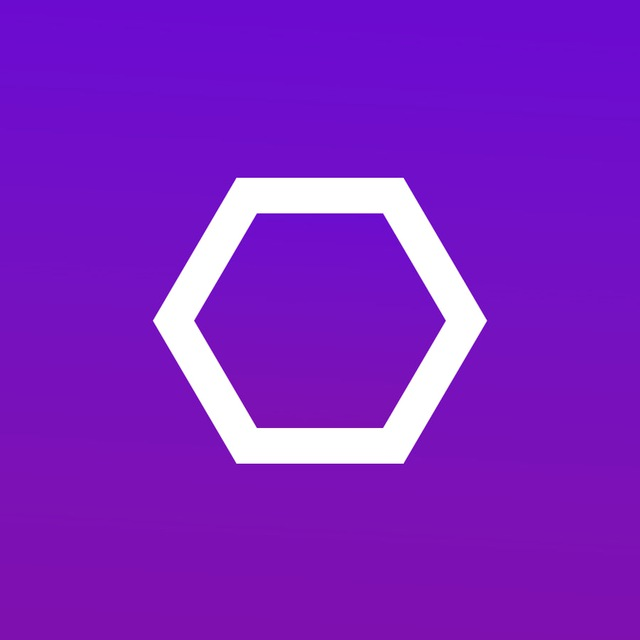

  

# About Us 🏆
AeroxStudio is a Russian software development company focused on blockchain technology, cryptography, and quantum systems. We were formed in 2024 and are currently working on projects such as: [AeroxChain](https://github.com/AeroxStudio/AeroxChain), [AeroxWallet](https://github.com/AeroxStudio/AeroxWallet).

## Our team of developers
Team Lead (CEO): Pedro ([X](https://x.com/pedro_aerox))

Chief Designer (CDO): Relax ([X](https://x.com/relax_aerox))
